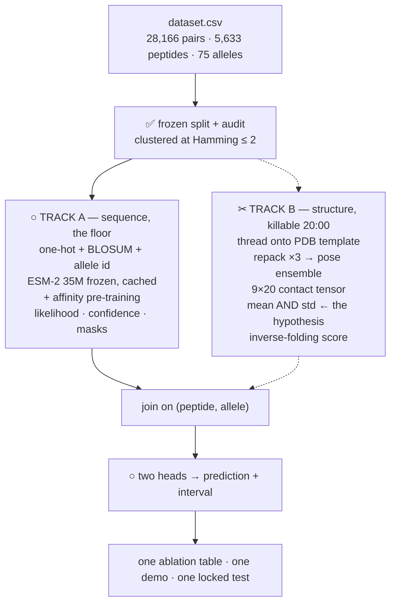
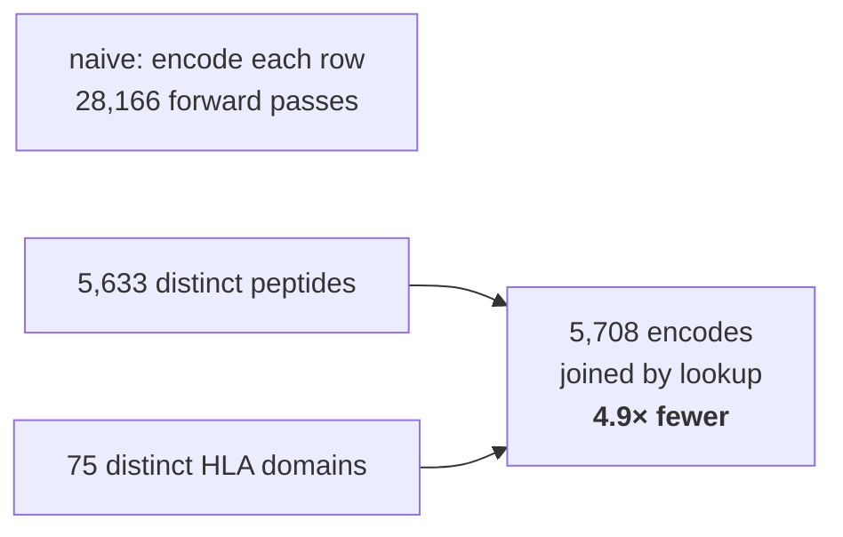
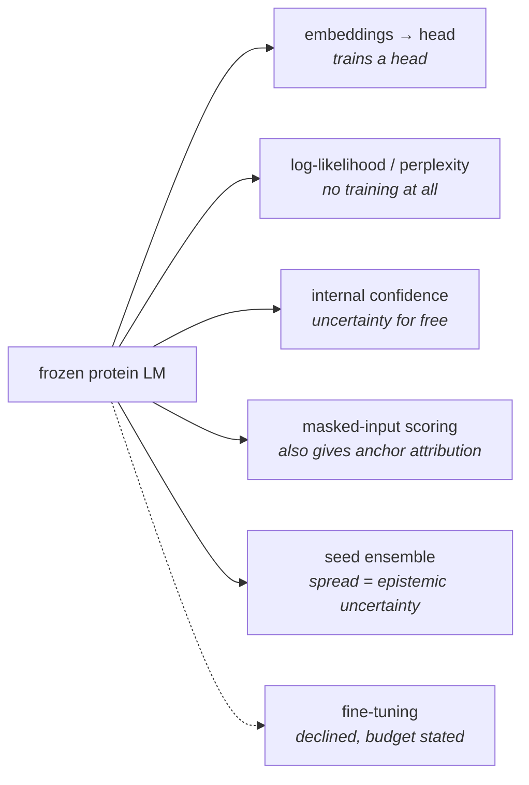
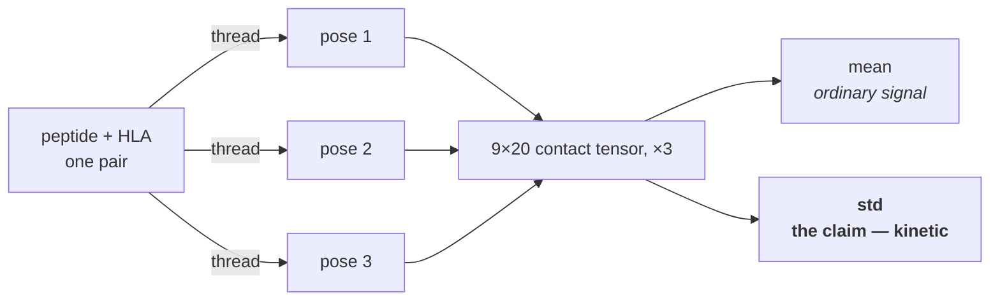
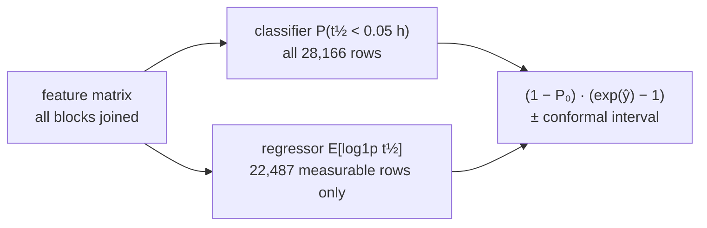

# Architecture — what we are building

A sequence model that is guaranteed to work, a structure branch that can be killed at any point,
and one evaluation both report into. Merged from the three plans; see `PLAN.md` for the evaluation
and `RECONCILIATION.md` for the conflicts and their evidence.

**Status at 16:45 Saturday.** The split and its audits are built and frozen. Everything downstream
is designed but not trained. Markers below: ✅ built · ○ proposed · ✂ killable.

---

## 1. The shape of it

Track B is dashed because it is **designed to be deleted**. If threading is not producing valid
structures by 20:00 it is killed and Track A ships alone — which is why Track A carries no dependency
on it. Both write a parquet keyed on `(peptide, allele)`, so the merge is a join and neither track
blocks the other.

## 2. Layer 1 — the frozen split ✅

Rows are (peptide, allele) pairs, and **94% of rows involve a peptide measured against more than one
allele**. Splitting rows at random puts the same fragment on both sides. So we split by peptide
cluster.

| Partition | Rows | Peptides | Purpose |
|---|---|---|---|
| train | 22,532 | 4,514 | fitting |
| **calibration** | **carve ~10% out of train** | — | **conformal intervals only** |
| val | 2,817 | 563 | model selection, early stopping |
| test | 2,817 | 556 | opened once, at the end |

- No eval peptide is within 2 substitutions of any training peptide — verified by brute force.
- A memorisation-only predictor scores **0.000** here, against **0.337** on a random row split.

**The calibration slice is the one structural change still needed.** Conformal prediction gives a
distribution-free coverage guarantee only if the calibration residuals are exchangeable with the test
ones. Validation is simultaneously being used to pick models, so its residuals are not. Taking those
rows from **train** costs ~10% of training data and keeps the guarantee. Empirical coverage can be
reported either way; it is the *guarantee* that needs clean rows.

## 3. Layer 2 — Track A, the sequence floor ○

Four rungs, each a row in the ablation table. The point is not the top rung; it is **the gap between
rungs**, because that is what attributes a gain to a cause.

| Rung | What it is | What its gap proves |
|---|---|---|
| B0 | Global median, then per-allele median | How much is allele identity alone, with no peptide information |
| B1 | **Simple supervised neural net** on one-hot/BLOSUM peptide + pseudosequence + explicit allele id | The honest bar. The brief asks for this by name, so the MLP is required — LightGBM is an addition, not a substitute |
| B1′ | Same, but HLA replaced by a **one-hot over 75 alleles** | **The sharpest control.** If this matches the embedding, the model memorised allele identity rather than using protein knowledge |
| F0 | Frozen ESM-2 35M embeddings + head | Does a general protein model add anything? Expect ≈ 0.57 |
| F1 | F0 + affinity pre-training transfer | Largest published single jump: 0.574 → 0.745 |

### Why the embeddings are cheap

The HLA is 182 of the 191 residues in a row, so **95% of the input is one of just 75 strings**. Also
cache the 9 per-residue peptide vectors, so anchor-position work needs no recompute.

**The caveat matters:** the moment the two chains attend to each other, the HLA's representation
depends on which peptide it is paired with and the cache is invalid. The thing that would make the
model more accurate is the thing that makes it expensive.

## 4. Layer 3 — six ways to use a foundation model ○

The brief names six routes and encourages exploring "under the hood". Using only embeddings answers
one sixth of it. **Five of the six need no training at all.**

Declining to fine-tune **is itself an answer** when the question is "are these models worth their
cost". The zero-shot likelihood route is especially clean: no training stage means no leakage surface
anywhere, and the entire dataset becomes an evaluation set.

## 5. Layer 4 — the structure branch and its one claim ✂

Every prior structural method for peptide-HLA scores a **single static pose**, which approximates a
*thermodynamic* quantity. Half-life is *kinetic*. The claim is that the **spread** across a pose
ensemble carries the kinetic signal the *mean* cannot.

This is the one genuinely novel claim in the project and it is **falsifiable in a single ablation
row**: mean-only vs mean-and-std, same head, same split.

> **Gate before the overnight run.** Repacking three times samples the *packing algorithm's
> stochasticity*, which is not a thermal ensemble. On ~200 pairs, generate ensemble A with seeds
> {1,2,3} and B with {4,5,6}, then correlate per-pair std across them. If std is not reproducible it
> is measuring solver noise, and the branch should die at this gate rather than at 02:00.

## 6. Layer 5 — two heads, because of the floor ○

A fifth of all labels are exactly `0.0`. That is **not** a complex with zero lifetime — the reporting
scale is 0.1 h, so `0.0` means **below 0.05 hours**, a left-censored value. Feeding it to a regressor
as a point observation, which the published work does, teaches the model a number the experiment
never measured.

Reports three things: classifier AUROC, regression metrics on measurable rows, and the combined
metric on everything. Because the censoring threshold is **known** — 0.05 h, derived from the
reporting grid rather than assumed — a Tobit likelihood is also directly implementable. The two-head
form is simpler and gives a second metric axis for free: "will this bind at all" is a useful output
on its own.

## 7. What the system actually outputs

Not a number. An ablation table where every row is the same head on the same split, differing only
in which feature blocks are concatenated — so each gap attributes a gain to a cause.

| Feature blocks | What the gap from the row above proves |
|---|---|
| peptide only | the dumbest possible floor |
| + allele one-hot | how much is just knowing which groove |
| + ESM-2 frozen | **does a general protein model add anything at all** |
| + affinity transfer | does related-task pre-training help |
| + inverse-folding score | zero-shot structural signal |
| + contacts, mean | ordinary structural signal |
| + contacts, mean & std | **the claim — does spread add kinetic signal** |

Every row is reported with **within-allele and pooled Spearman**, because pooled alone is inflated by
between-allele differences on this dataset: unrelated pairs score 0.335 pooled against 0.027
within-allele.

**A gap that survives within-allele is strong evidence. The converse does not hold** — with roughly
38 test rows per allele that check is underpowered, so a gap appearing only in the pooled number is
*unresolved*, not disproved. Settle it with `paired_bootstrap()` on real residuals rather than
discarding it. (An earlier version of this line said such a gap was "an artefact"; that was based on
a power analysis that did not reproduce and is retracted — see `POWER_ANALYSIS.md`.)

Every ablation row carries **Δ with its confidence interval**, never a bare number.

---

Split counts and the 4.9× caching figure measured from `context/dataset.csv` and
`splits/peptide_split.csv`. Published Spearman figures from Karthikeyan, Vincent & Rubinsteyn,
bioRxiv 2026. A styled HTML version of this page is at `docs/architecture.html` — open it in a
browser; it renders the same diagrams with more detail in the captions.
