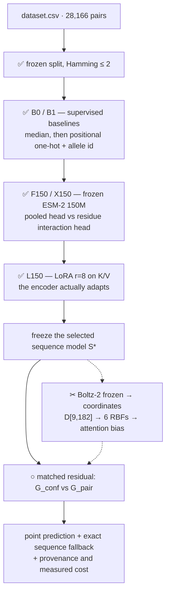
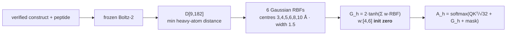

# Architecture — GeoStab-FT

The build spec for the plan of record, **`docs/GeoStab-FT-build-plan.pdf`**. That document governs;
this one is its diagram and first-stage checklist. Where they disagree, it wins.

**Status.** The split and its audits are frozen. The sequence ladder is built and measured through the
**frozen**-encoder rungs: B0/B1/B1' and F150/X150 have run; L150 and the structural arm have not.
Markers: ✅ built · ○ specified, not built · ✂ killable.

---

## 1. The shape — a ladder, not parallel tracks

Each rung is frozen before the next is fitted. That ordering is the design: a small structural cohort
can never overwrite the full-data adapter, and the fallback for a missing structure is **exact**.

**Why freeze-then-residual.** `G_conf` (confidence only) and `G_pair` (confidence + geometry) share an
identical architecture, initialisation, training rows and selection budget. Their difference is
therefore attributable to geometry alone. Any pair whose structure is missing or invalid falls back to
exactly the frozen sequence prediction — the same number in both arms.

## 2. The frozen split ✅

| Partition | Rows | Peptides |
|---|---|---|
| train | 22,532 | 4,514 |
| val | 2,817 | 563 |
| test | 2,817 | 556 |

Rows are (peptide, allele) pairs and **94% involve a peptide measured against more than one allele**,
so a random row split puts the same fragment on both sides. Clustered at Hamming ≤ 2; no eval peptide
is within 2 substitutions of any training peptide.

**Two known gaps, both flagged P0 by the plan of record.** `audit_splits.py` currently asserts
distance ≤ 1 while the contract is ≤ 2, so a distance-2 violation would pass. And
`measure_leakage_by_distance.py` fits its per-allele normalisation over **all** rows, which
contaminates the analysis that claims to be train-only. Neither is fixed yet; see §7.

Separate **calibration** rows (carved from train, never val) are required before any per-prediction
interval is shown. Metric confidence intervals are not prediction intervals.

## 3. The sequence ladder — measured through F150/X150

| Rung | What | What its gap proves |
|---|---|---|
| **B0** | Training-only global, then per-allele median | How much is allele identity alone |
| **B1** | Positional one-hot MLP: 180 peptide + 680 pseudosequence values **+ allele identity** | The honest bar. The brief asks for a supervised neural net by name |
| **B1′** | Same, HLA replaced by a **one-hot over 75 alleles** | If this matches the embedding, the model memorised allele identity rather than using protein knowledge |
| **F150** | Frozen ESM-2 150M, **mean-pooled** head | The cheap control |
| **X150** | Frozen ESM-2 150M, **residue interaction head** | H2 — does the head design help? Mean-pooling a 9-mer discards exactly the positional information anchors live in |
| **L150** | **LoRA r=8, α=16, dropout 0.05 on K/V** | H1 — does genuine adaptation help? `W_eff = W + (α/r)·BA`. This is the brief's question |
| U150 | Partial unfreeze of original weights | H3 — is the extra cost justified? Optional |

Don't anchor on the paper's 0.574 — that was ESM-2 **650M** on a different split with a different HLA
input. No borrowed number is an expected value here.

**On caching.** 28,166 rows contain only 5,633 distinct peptides and 75 distinct HLA domains, so the
frozen rungs need 5,708 encodes rather than 28,166 — **4.9× fewer**. This holds **only while the
encoder and adapters are unchanged**. Once LoRA trains, the cache is void.

## 4. Six ways to use a foundation model ○

*Ported from the earlier architecture: the plan of record covers heads and fine-tuning but not the
zero-training routes, and the brief names all of them.*

| Route | Status | Cost |
|---|---|---|
| Embeddings → head | F150 / X150 above | core |
| **Log-likelihood / perplexity** | **Not in the plan of record. Add it.** Score the peptide in HLA context, and context-minus-no-context to isolate what the groove explains | no training at all |
| **Internal confidence** | Feeds `G_conf` as a feature; also an uncertainty estimate | ~1h |
| **Masked-input scoring** | Mask each of P1–P9 in turn — doubles as anchor attribution | ~2h |
| **Seed ensemble** | Spread as epistemic uncertainty | ~1h |
| Fine-tuning | **L150, core.** The brief explicitly permits it | core |

The likelihood route has no training stage, so no leakage surface anywhere and the whole dataset is
an evaluation set.

## 5. Geometry as a learned attention bias ✂

**We do use Boltz-2 — for coordinates only.** It has two outputs and we take exactly one:

| Boltz-2 output | Use it? | Why |
|---|---|---|
| **3D coordinates** of the complex | ✅ **yes** — the whole reason it is here | The dataset has no structures, so distances have to be generated |
| Affinity prediction | ❌ **no** | Its docs require the binder to be *"a ligand chain (not a protein, DNA or RNA)"*, ~56 atoms. A 9-mer is a protein chain, so that head would return a number for an input it does not support. This is why `archive/plans/training pipeline.pdf` is superseded — it drew that head as a Stage-1 output |

**"Frozen" means never trained.** Boltz runs as a fixed tool: sequences in, coordinates out, no
gradient back. The only trainable parameters in this section are the **24** RBF weights `w:[4,6]`,
far downstream of it.

Geometry **modulates attention** rather than decorating a feature vector, and starts as a no-op, so
only 24 parameters have to earn their place. Masked/missing pairs contribute exactly zero.

**Comparators:** the 9×20 fixed contact tensor survives as a cheap control against the learned bias
(H5). A K=3 pose ensemble is a **later ablation, not core throughput** — and its spread is
model/template sensitivity, **not** measured physical entropy or an off-rate.

**Cohort:** pilot alleles `HLA-A*02:01` and `HLA-B*15:01`, capped at 512 train / 64 val / 128 test,
whole peptide components, seed 42, frozen before inference. Never swap a failed test case for an
easier one.

**Construct eligibility.** The 182-aa domain is an exact substring of the full heavy chain at offset
24, and 72/75 alleles map. Quarantine the three `(C67S)` constructs and the three domain-mismatch
alleles (`HLA-B*08:03`, `HLA-A*02:50`, `HLA-A*24:19`) — **2,238 of 28,166 rows, 7.9%**. They stay in
the sequence experiment; only the structural arm excludes them.

## 6. The zero labels — a declared experiment, not a default ○

**Do not add a censored head by default.** The CSV does not establish a detection limit, and a hurdle
model is a separate empirical experiment rather than an automatic correction.

What we did measure: `0.0` holds **5,679 rows against 443 at 0.1 and 1,297 at 0.2** — 13× its
neighbour and non-monotonic, so it is a distinct point mass rather than the rounded tail of a
continuum. The reporting grid is 0.1 h, so any value below 0.05 h lands there. The *mechanism* —
assay floor or genuine non-binders — is undetermined.

That justifies running a hurdle model **as a declared, falsifiable comparison** (classifier for the
zero class + regressor on the 22,487 measurable rows, against a plain regressor on the same rows),
and reporting whichever wins. It does not justify assuming censoring.

## 7. What gets reported

Primary: **Spearman with paired peptide-component bootstrap** — 2,000 draws, seed 2026, percentile
bounds 2.5/97.5, keeping all rows of each drawn component. Report the interval **unavailable** if
fewer than 95% of draws are valid; never silently resample.

Alongside: log-MAE/RMSE, operational hours-MAE, supported within-allele metrics, counts, seed
variation, GPU cost, latency, coverage and failures. Spearman does not establish absolute hours;
Pearson alone does not establish calibration. An interval spanning zero is **inconclusive**, not
equivalence.

### Open P0 fixes before any result is trusted

| ID | Gap |
|---|---|
| **A1** | `audit_splits.py` enforces Hamming ≤1 while the contract is ≤2 |
| **M1** | `peptide_lookup_score` returns `0.0` as a sentinel on low coverage — our reported "Spearman 0.000" is that sentinel, not a measurement. The **0% coverage** is the real evidence |
| **D1** | `measure_leakage_by_distance.py` normalises over all rows, so its "train-only" analysis is not train-only |
| **D4** | The split detector plants a 1-edit positive; the contract boundary is 2 edits |

---

**B0 / B1 / B1′ and F150 / X150 are built and run** — see `results/README.md` for every number,
what it shows, and what it does not establish.

Measured (validation, 3 seeds, seed-ensemble mean):

| Rung | ρ pooled (95% CI) | ρ within-allele (95% CI) |
|---|---|---|
| B0b per-allele median | 0.563 [0.522, 0.598] | undefined |
| F150 frozen ESM-2, mean-pooled | 0.593 [0.556, 0.625] | 0.278 [0.222, 0.320] |
| B1′ one-hot peptide + allele id | 0.748 [0.719, 0.775] | 0.557 [0.508, 0.585] |
| X150 frozen ESM-2, cross-attention | 0.754 [0.727, 0.777] | 0.558 [0.508, 0.585] |
| L150 LoRA-adapted, same head | 0.757 [0.732, 0.780] | 0.572 [0.524, 0.599] |
| B1 one-hot + pseudoseq + allele | **0.780 [0.756, 0.802]** | **0.633 [0.588, 0.654]** |

Two headlines. **H2 is answered**: the head design is worth +0.161 pooled / +0.280 within-allele
against seed spreads of 0.025 / 0.039, so mean-pooling — not model size — was the binding constraint
on the frozen rungs. And **the frozen PLM does not beat one-hot**: X150 and B1′ agree to within seed
noise, while B1 beats both using no protein language model at all.

**H1 is answered: adaptation does not help.** L150 − X150 is +0.003 pooled [−0.012, +0.018] and
+0.014 within-allele [−0.020, +0.045] — both spanning zero, so adaptation is worth at most +0.018
pooled. And B1 still beats the adapted model: **+0.023 [+0.007, +0.039] pooled, +0.060
[+0.027, +0.094] within-allele**, both excluding zero.

Run 5 supplies the mechanism: position ablation on the trained model recovers the P2/P9 anchors
from data alone, while ESM-2's own likelihood profile is flat and rank-correlates −0.03 with it.

Next: the structural arm (B1 only — Boltz-2 runs, see `modal_boltz.py`), the demo, and a single
read of the frozen test split once the model choice is final. Split counts measured from
`splits/peptide_split.csv`.
